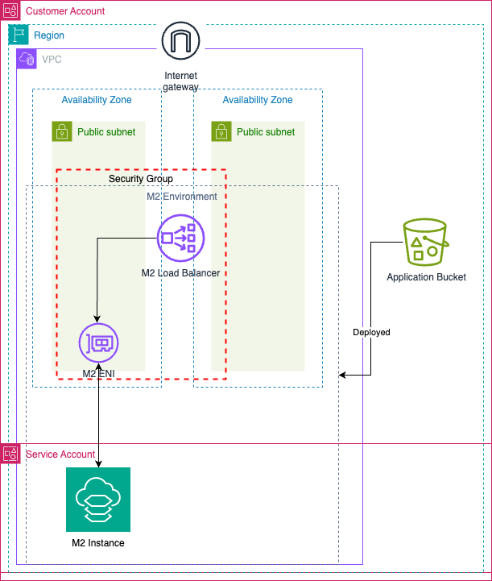

# AWS Mainframe Modernization now available in Terraform

### [View all Roadmaps](https://github.com/nholuongut/all-roadmaps) &nbsp;&middot;&nbsp; [Best Practices](https://github.com/nholuongut/all-roadmaps/blob/main/public/best-practices/) &nbsp;&middot;&nbsp; [Questions](https://www.linkedin.com/in/nholuong/)
 

This Terraform code is the companion to the AWS Mainframe Modernization now available in Terraform blog post.

## Example Archictecture

See [CONTRIBUTING](CONTRIBUTING.md#security-issue-notifications) for more information.

# 🚀 I'm are always open to your feedback.  Please contact as bellow information:
### [Contact ]
* [Name: nho Luong]
* [Skype](luongutnho_skype)
* [Github](https://github.com/nholuongut/)
* [Linkedin](https://www.linkedin.com/in/nholuong/)
* [Email Address](luongutnho@hotmail.com)

# License
* Nho Luong (c). All Rights Reserved.🌟